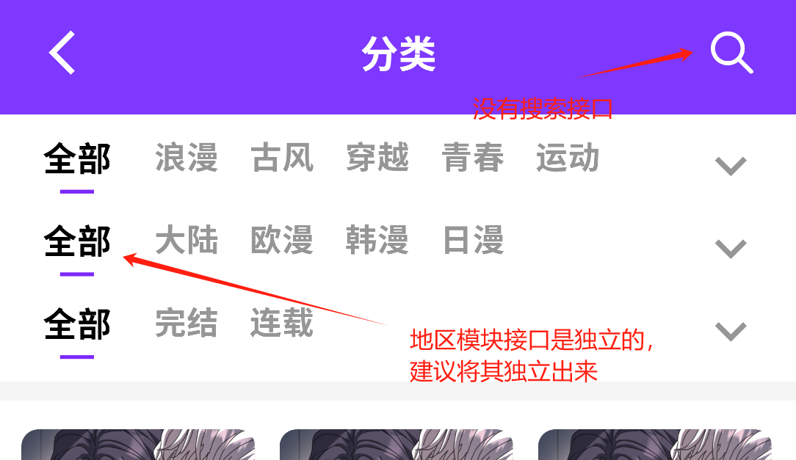
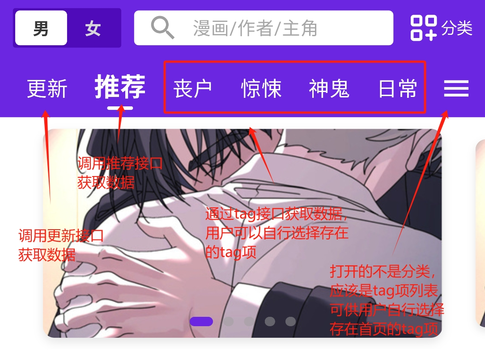
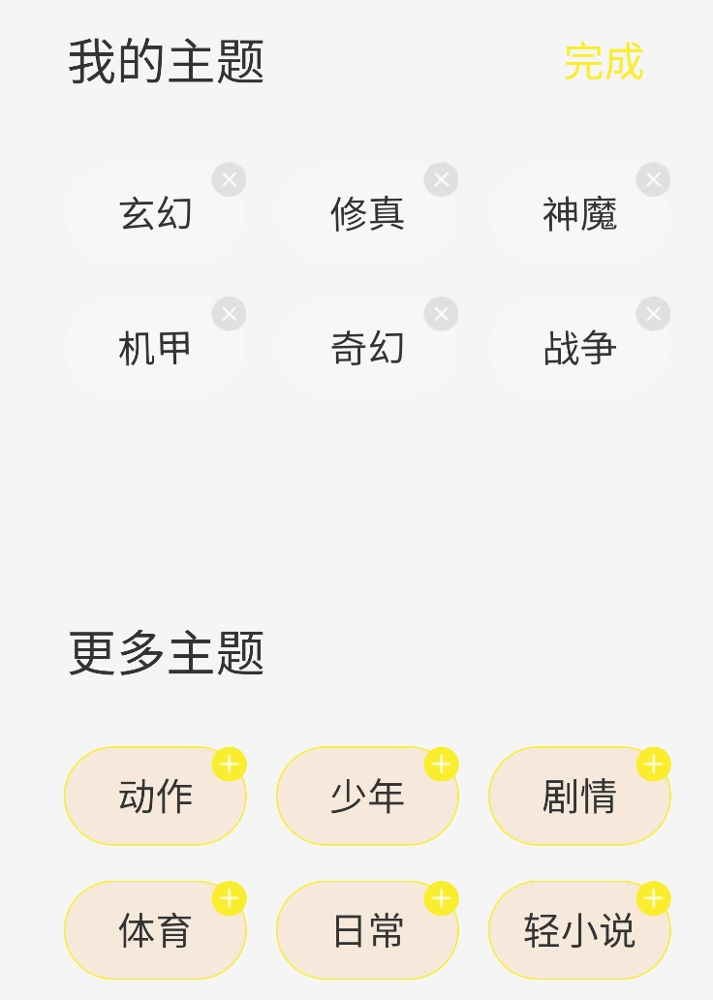
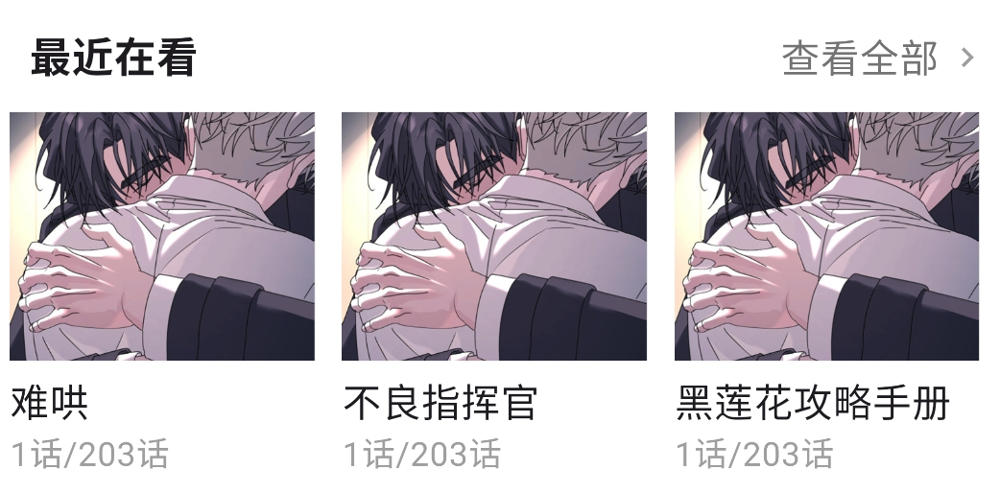
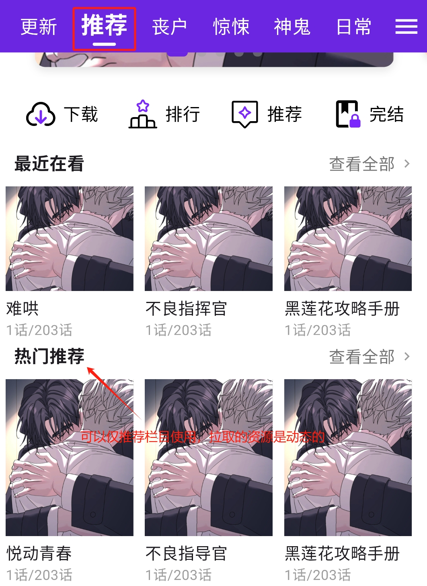
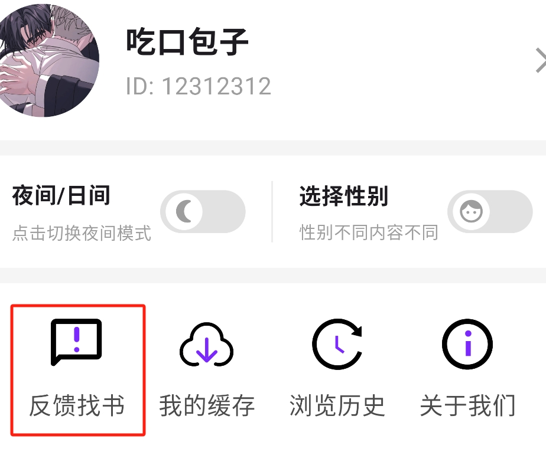
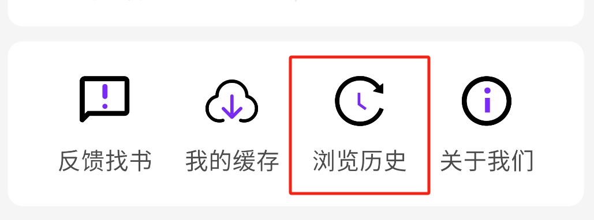

# 功能映射文档
#### 1. [首页](#1-首页)
  - [公告](#公告)
  - [搜索](#搜索)
  - [分类](#分类)
  - [标签导航栏](#标签导航栏)
  - [轮播图](#轮播图)
  - [排行榜](#排行榜)
  - [推荐（新书推荐）](#推荐新书推荐)
  - [完结](#完结)
  - [最近在看](#最近在看)
  - [热门推荐](#热门推荐)
#### 2. [书架](#2-书架)
  - [最近收藏](#最近收藏)
  - [最近在看](#最近在看)
  - [猜你喜欢](#猜你喜欢)
#### 3. [我的](#3-我的)
  - [反馈找书](#反馈找书)
  - [浏览历史](#浏览历史)
#### 4. [广场](#4-广场)

## 1. 首页

### 公告
- 参考文档:
  - [主页公告模块](../home_page/README.md)

### 搜索

- 参考文档:
  - 漫画首页模块 >> [搜索漫画信息](../cartoon/README.md#3-搜索漫画信息)
  - 漫画首页模块 >> [热搜数据](../static/README.md#7-拉取热门发现)

### 分类

- 参考文档:
  - 静态资源模块 >> [分类资源](../static/README.md#分类资源)
- 说明：
  1. 拉取分类列表，获取各个类别的名称和ID（分类中不包含地区列表，即大陆、欧漫、日漫等）
  2. 想要具体查看某个分类的详情时，根据分类ID拉取分类详情

### 标签导航栏

- 参考文档:
  - 静态资源模块 >> [标签资源](../static/README.md#标签资源)
  - 静态资源模块 >> [今日热点](../static/README.md#1-拉取今日热点)
  - 静态资源模块 >> [更新数据](../static/README.md#8-拉取更新数据)
- 说明：
  1. 导航栏除拉取标签列表外，还需要从其他资源拉取更新数据、今日热点
  2. 拉取标签列表后，可以根据标签ID拉取相应标签的详情

- 参考其他app：
  - 参考1

  - 参考2

### 轮播图

- 参考文档:
  - 静态资源模块 >> [轮播图](../static/README.md#2-拉取轮播图)
- 说明：
  1. 轮播图配置中的jumpUrl中的content字段为漫画ID，用于点击轮播图跳转到相应漫画

### 排行榜

- 参考文档:
  - 静态资源模块 >> [排行榜](../static/README.md#5-拉取排行榜)
- 说明：
  1. 完结榜不用于排行榜
- 参考其他app：
  - 参考1

### 推荐（新书推荐）

- 参考文档:
  - 静态资源模块 >> [新书推荐](../static/README.md#4-拉取新书推荐)

### 完结

- 参考文档:
  - 静态资源模块 >> [排行榜](../static/README.md#5-拉取排行榜)
- 说明:
  1. 从排行榜中拉取完结榜作为完结推荐

### 最近在看

- 参考文档:
  - 漫画历史记录模块 >> [获取阅读历史](../cartoon_history/README.md#2-获取阅读历史)

### 热门推荐

- 参考文档:
  - 静态资源模块 >> [栏目资源](../static/README.md#栏目资源)
- 说明:
  1. 栏目列表是动态的，拉取栏目列表后可以根据栏目ID拉取对应的首页栏目静态资源
  2. 详细栏目信息可以通过栏目ID拉取

## 2. 书架

### 最近收藏

- 参考文档:
  - 书架模块 >> [获取用户书架](../cartoonshelf/README.md#4-获取用户书架)

### 最近在看

- 参考文档:
  - 漫画历史记录模块 >> [获取阅读历史](../cartoon_history/README.md#2-获取阅读历史)

### 猜你喜欢

- 参考文档:
  - 书架模块 >> [书架推荐](../cartoonshelf/README.md#6-书架推荐)

## 3. 我的

### 反馈找书

- 参考文档:
  - [反馈模块](../feedback/README.md)
- 说明:
  1. 先拉取用户反馈列表，这个相当于一个简短的问题汇总
  2. 当用户需要反馈时，根据需要拉取用户反馈标签列表，标签ID将用于反馈信息的type字段
  3. 用户反馈和章节纠错分别调用不同的接口，不可混淆

### 浏览历史

- 参考文档:
  - 漫画历史记录模块 >> [获取阅读历史](../cartoon_history/README.md#2-获取阅读历史)

## 4. 广场

### 话题与书评
